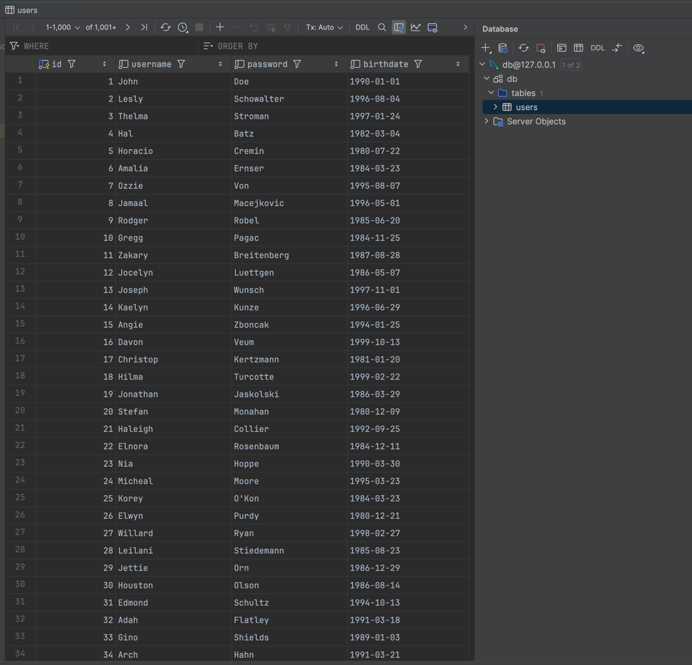
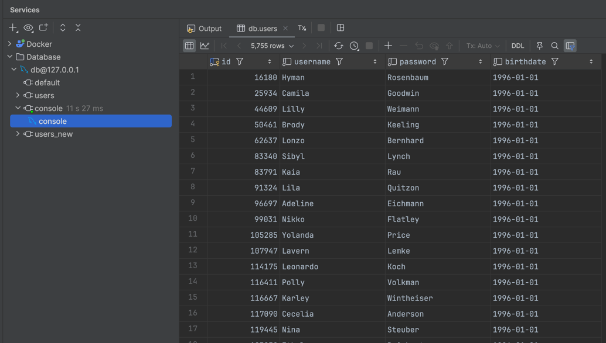
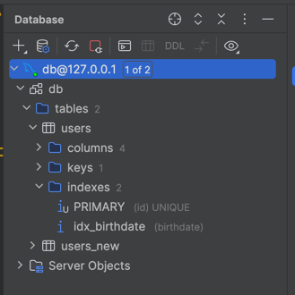
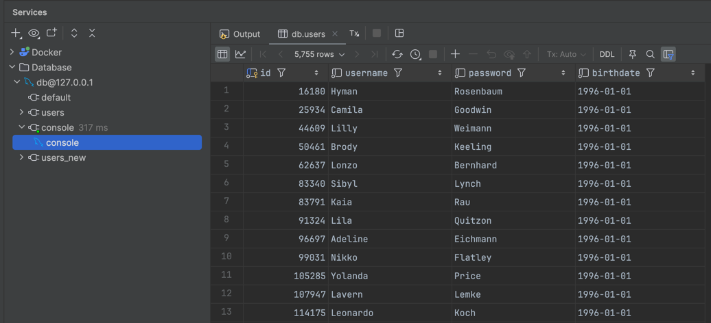
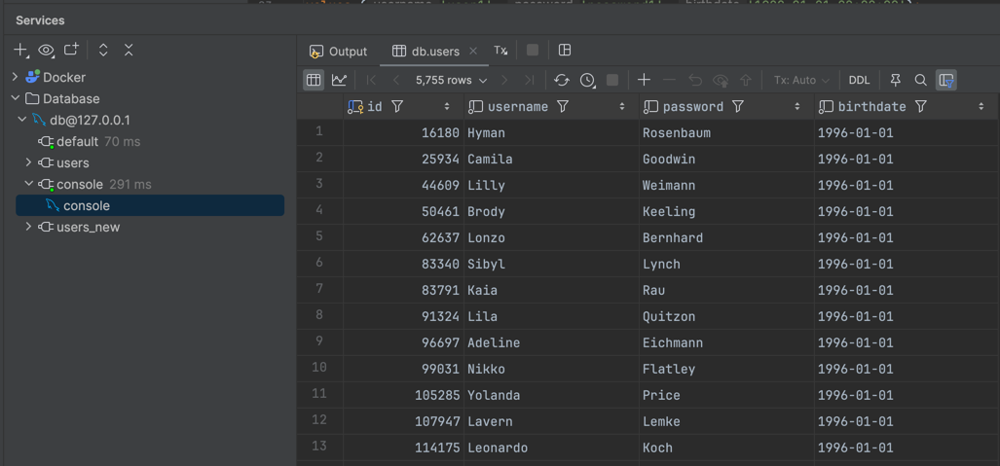

# SQL Databases

## Use MySQL (or fork) with InnoDB.

```docker
version: '3.9'
services:
  mysql:
    image: mysql:8.0.27
    container_name: mysql
    platform: linux/amd64
    environment:
      MYSQL_ROOT_PASSWORD: root
      MYSQL_DATABASE: db
      MYSQL_USER: linnyk
      MYSQL_PASSWORD: linnyk
    ports:
      - "3306:3306"
    volumes:
      - ./mysql_data:/var/lib/mysql
      - ./init.sql:/docker-entrypoint-initdb.d/init.sql

```

## Make a table for 40M users.

```sql
CREATE TABLE IF NOT EXISTS users (
    id         INT AUTO_INCREMENT PRIMARY KEY,
    username   VARCHAR(50) NOT NULL,
    password   VARCHAR(50) NOT NULL,
    birthdate  DATE NOT NULL
) ENGINE=InnoDB;
```



```sql
select count(*) as users from users;
```


- Filled the table with random users with birth dates between `1980-01-01` and `2000-01-01`.

## Compare performance of selections by date of birth:

### Without index

```sql
select * from users where birthdate == '1996-01-01';
```

- `5755` rows
- `11s 27ms` to execute




### With BTREE index

```sql
CREATE INDEX idx_birthdate ON users (birthdate);
```

- Takes `50s 65ms` to create index



```sql
select * from users where birthdate == '1996-01-01';
```

- Takes `317ms` to execute



### With HASH index

```sql
CREATE INDEX idx_birthdate ON users (birthdate) USING HASH;
```

- Takes `47s 333ms` to create hash index

```sql
select * from users where birthdate == '1996-01-01';
```



- Takes `291ms` to execute


## Check insert speed difference with different innodb_flush_log_at_trx_commit value and different ops per second

### innodb_flush_log_at_trx_commit = 0

```sql
SET GLOBAL innodb_flush_log_at_trx_commit = 0;
```

```
Time taken: 30 seconds to create 34061 users
```

### innodb_flush_log_at_trx_commit = 1

```sql
SET GLOBAL innodb_flush_log_at_trx_commit = 1;
```

```
Time taken: 30 seconds to create 28482 users
```

### innodb_flush_log_at_trx_commit = 2

```sql
SET GLOBAL innodb_flush_log_at_trx_commit = 2;
```

```
Time taken: 30 seconds to create 34902 users
```